# Interview Tracker

One stop solution for every coding interviews.

The deployed website can be found here : [Website](https://interview-tracker-iit.herokuapp.com/)

Following features are present in the web applicaton.

## Home Page
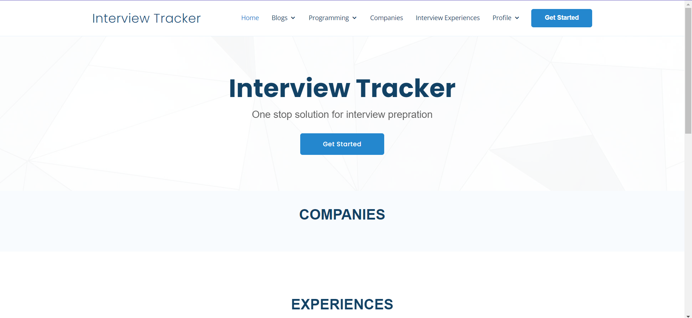

## Authentication
### Log In
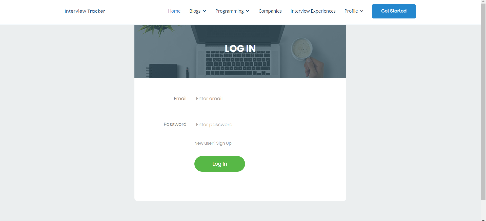
### Sign Up
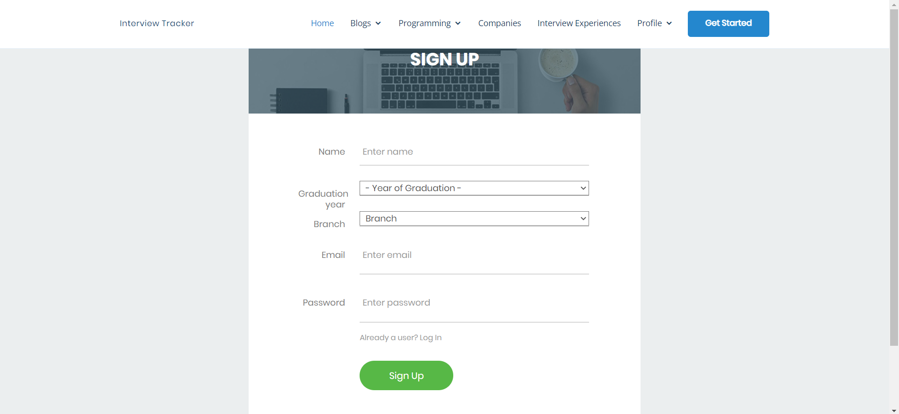

## Blogs
### All Blogs
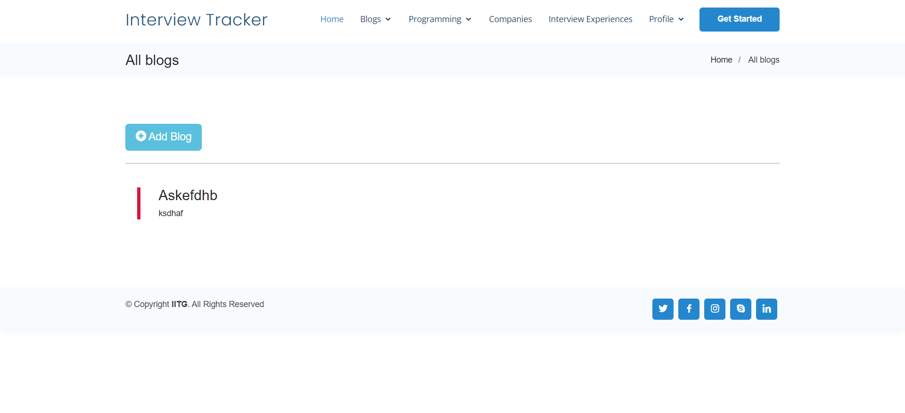
### My Blogs
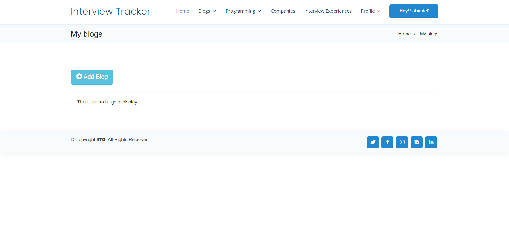
### New Blog
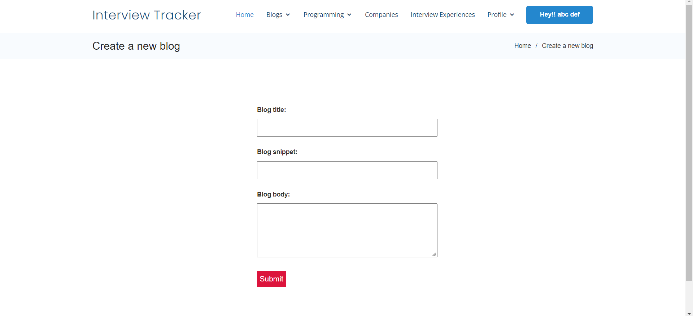

## Programming
### Categories
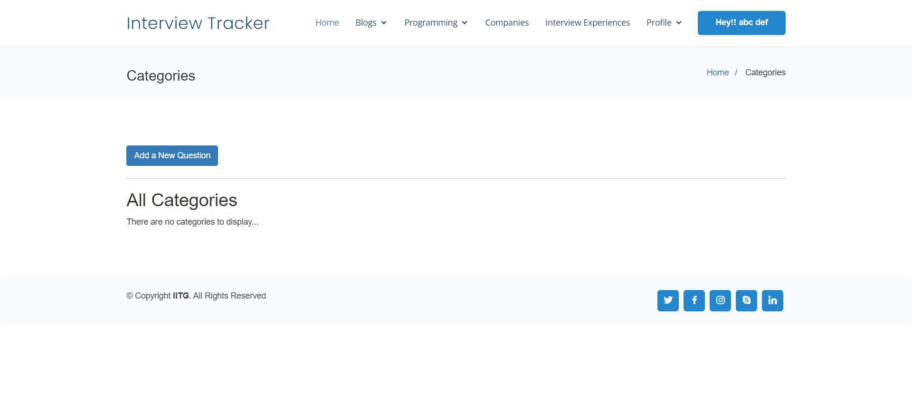
### All Questions
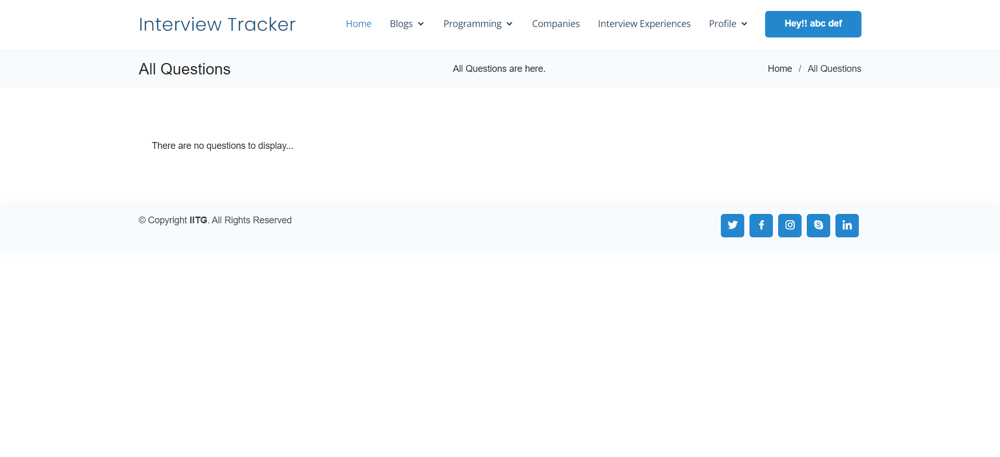
### Add a new Question
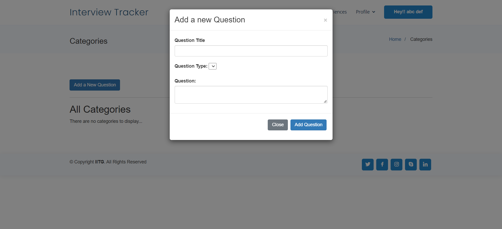

## Companies
### All Companies
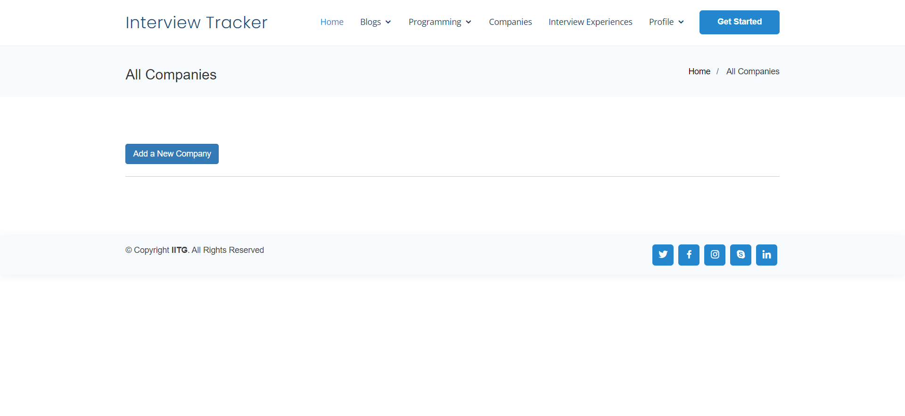
### Add a new Company
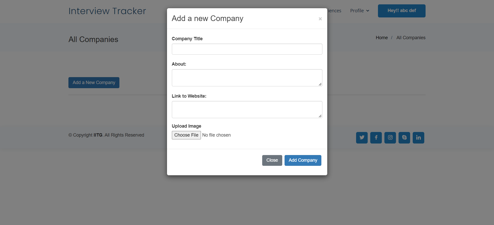

## Interview Experiences
### Experiences
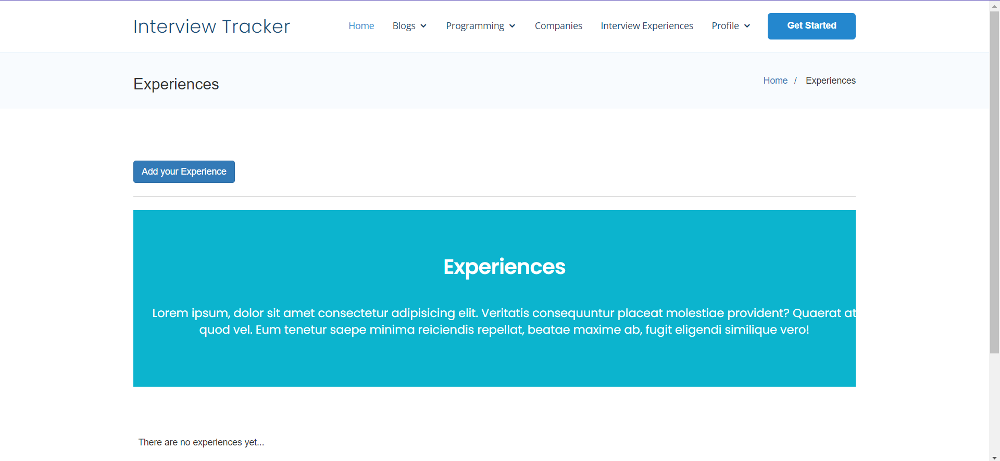
### Add your Experiences
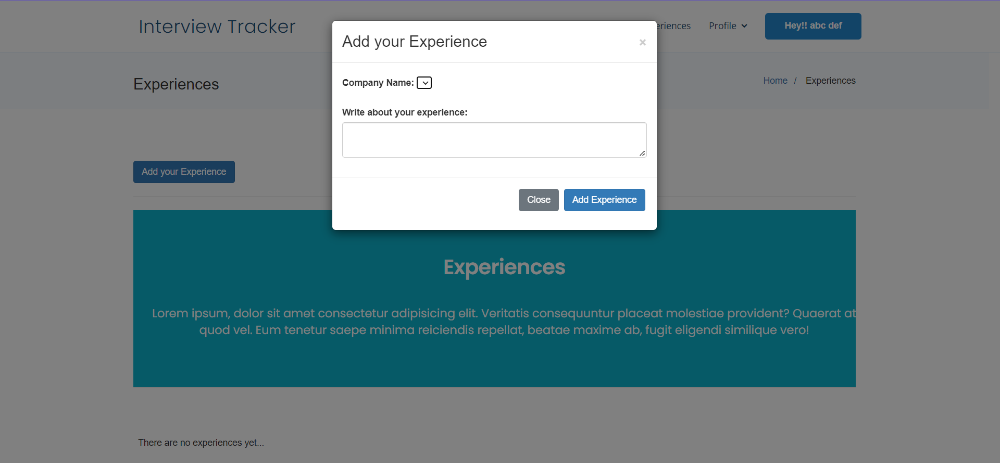

## Profile
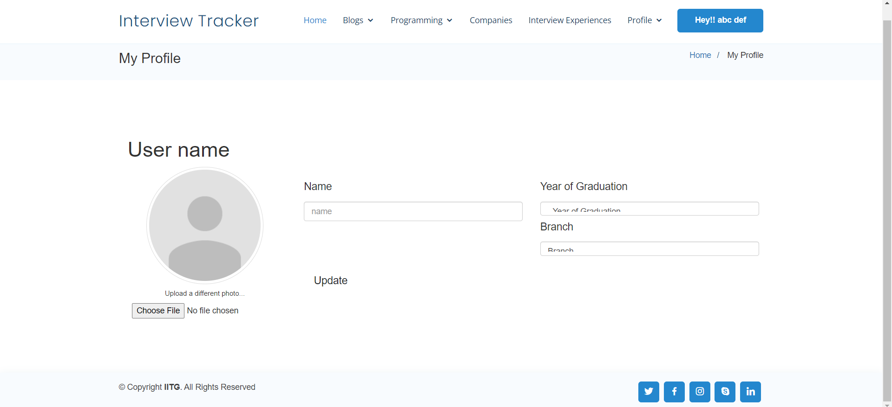
